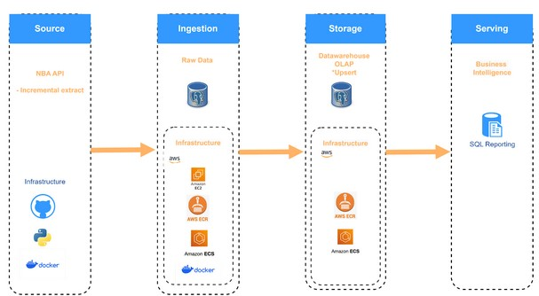

Data Engineering on NBA data https://api-sports.io/documentation/nba/v2
# Project plan 

## Objective 
Our objective is to extract datasets from API-NBA to create a database with data related to the NBA that can be used for analysis.

## Consumers 
What users would find your data useful? How do they want to access the data? 

Example: 

The users of our datasets are Data Analysts/Scientists. 

## Questions 

Who are the top players by score?
Which team has won most home games?
Which team has lost most away games?
Which team has scored most points?

## Source datasets 
What datasets are you sourcing from? How frequently are the source datasets updating?

RapidAPI | API-NBA
Endpoints:
Games (https://api-sports.io/documentation/nba/v2#tag/Games)
Standings (https://api-sports.io/documentation/nba/v2#tag/Standings)
Players (https://api-sports.io/documentation/nba/v2#tag/Players)

## Solution architecture
How are we going to get data flowing from source to serving? What components and services will we combine to implement the solution? How do we automate the entire running of the solution? 

- What data extraction patterns are you going to be using?
  Incremental extract
- What data loading patterns are you going to be using?
  Upsert load 
- What data transformation patterns are you going to be performing?
  Aggregations of data, flattening data, filtering and re-naming columns

There are four stages in our solution architecture. In the real-world we would have a BI-Solution like PBI/Tableau/Qliview etc as a presentation layer. However since our audience/Customers are Data Scientists and/or data analysts we have provided final solution in postgres database where users can query the data using SQL.
#### 1. Source
- We extract data from from an API
- Use python programing language for api requests
- We use git as a source
#### 2. Ingestion
- ETL Pipeline is a Python module
- This pipline is containarized using Dokcer containers
- Docker Container is deployed to AWS ECR
- This ECR image is utilized inside an ECS cluster
- On the ECS Cluster we run scheduled task once every 24 hour to run the pipeline
#### 3. Storage
 - The NBA data is stored on AWS hosted postgres RDS
 #### 4. Serving
 - Users can query the data using sql on AWS RDS
We do not have to mention this but just as a note to ourselves - Our intial plan was to perform an ELT ut we ended up doing an ETL process. So now we have only one db called nba.

## Breakdown of tasks 
How is your project broken down? Who is doing what?

Using a Trello board, we have broken down the project into tasks and will collaborate in parallel where possible.
https://trello.com/b/qoa1XIgH/project-1
