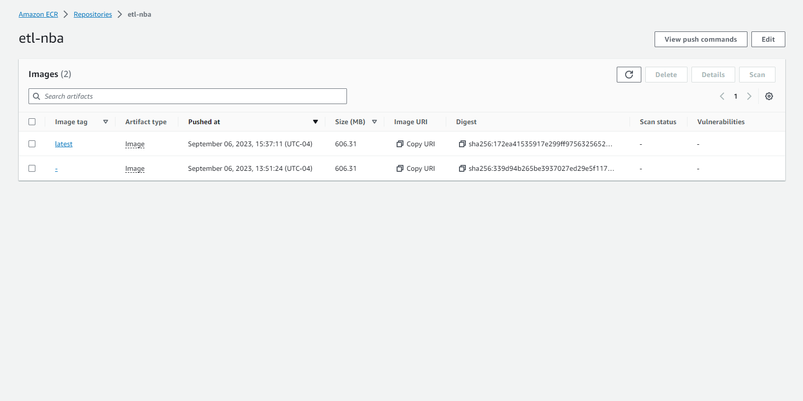
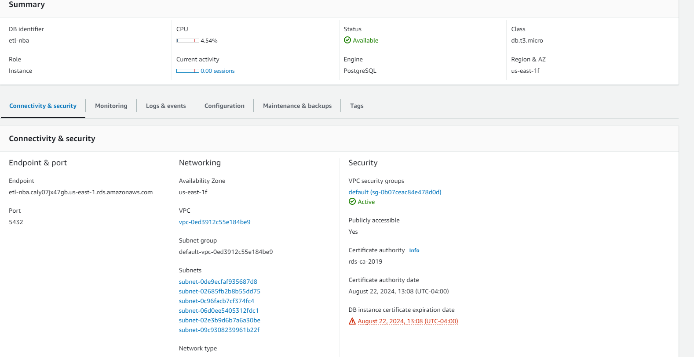
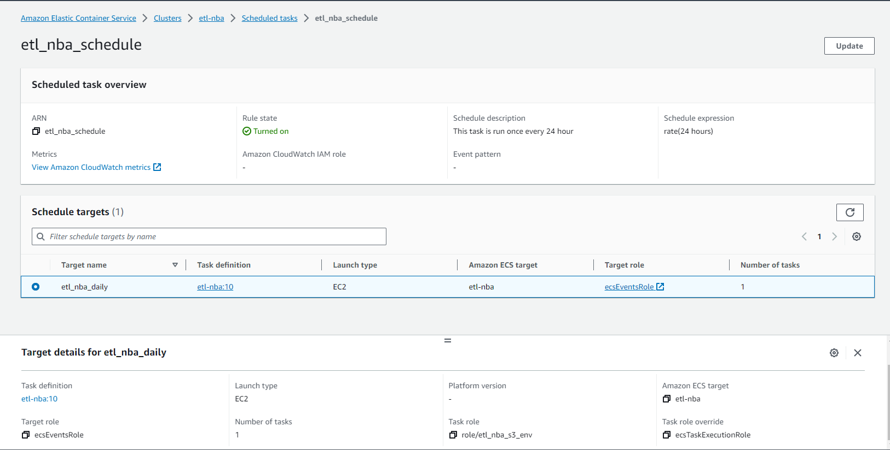
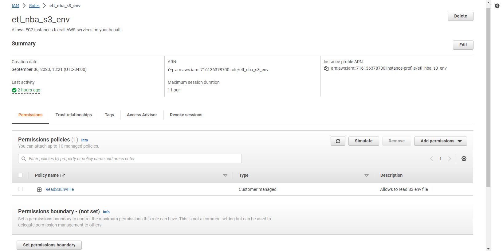
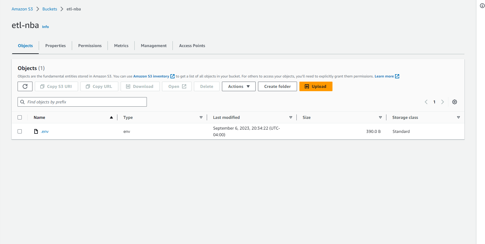
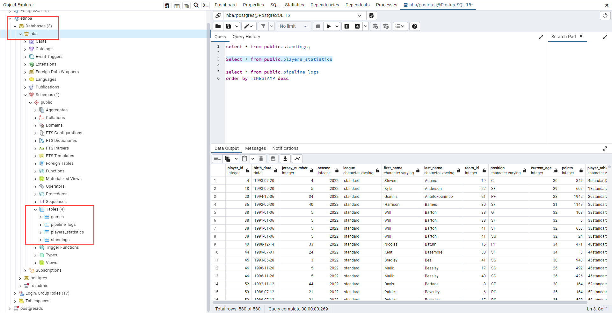

## OBJECTIVES
Extract datasets from API-NBA to create a database with basketball data that can be used for analysis
Practice ETL techniques and concepts learned in class. For Details About the Overall Idea behind the project please refer [Project Plan](Project Plan.md)
## GOALS
Answer questions such as:
What’s the average age of top 10 scoring players?
Which game had the biggest score difference?
What’s the highest number of team wins per division?
## Runbook
1. Get the Data.
    - Get API key by registering <a href="https://rapidapi.com/api-sports/api/api-nba/pricing">here</a>
    - Try out the API by experimenting with different <a href="https://api-sports.io/documentation/nba/v2#tag/Seasons">Endpoints</a> provided for Games, Leagues, Players etc.
    - We chose to go with three :- Games, Teams, PlayerStatistics, Standings.
2. Extraction And Load Layer :
    - You can find [here](app\etl_project\pipelines\nba.py) the API code for extracting the data from those 4 endpoints, specifying few params and extracting only the data we need from the response in order to build our Load Tables. Performing following tranformations :- selecting/renaming columns, grouping, aggregation, changing data types, calculated columns, merge.
3. Infrastructure Setup
    - Create AWS account, and have CLI access setup.
    - Docker: We created this [DockerFile](Dockerfile) and build the image locally.
    - Created an ECR repository to hold the docker images as shown:  
    - Use `docker push <repository URI>` command locally to push image to ECR.
    - Create and RDS instance as shown: 
    - Create ECS cluster to deploy the image. For that we create an ECS Task:  which creates a task template and an IAM role  to access env file in private S3 bucket.   The env file has all the secrets for all the infrature set and API call.
    - When the task runs, it pull data from the API and populates in postgres tables 